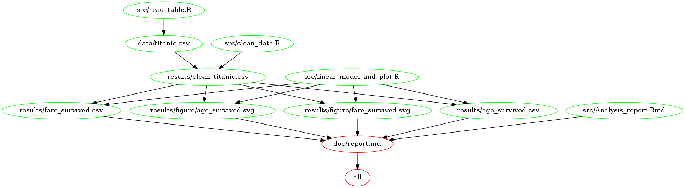

# Milestone V1.0
### Ruoqi Xu, 2017-12-13

## Data
[Titanic data](https://github.ubc.ca/ubc-mds-2017/datasets/blob/master/data/titanic.csv)

## Question
If there are linear relationship between survive rate, age, and fare.

## Hypotheses
- The old man had lower survival rate than the child because the old man's physical fitness is not as good as the young man. 

- People who pay high fare has higher survival rate than others.

## Project structure

    |- CITATION.md
    |
    |- README.md
    |
    |- LICENSE.md
    |
    |- doc/           # directory for documentation, one subdirectory for manuscript
    |
    |- data/          # data for storing fixed data sets
    |
    |- src/           # any source code
    |
    |- from_partner/           # any compiled binaries or scripts
    |
    |- results/       # output for tracking computational experiments performed on data


## Analysis  

* Analysis of the data to respond to the specifically requested results (2 hypotheses above) is completed in the ./doc folder.
* For the first hypotheses, based on our results, the age of two groups(survived or not) are no significant different. There are no significant linear relation between age and survived.
* For the second hypotheses, based on our results, the fare of two groups(survived or not)is significant different. People who pay high fare has higher survive rate than others.

## Plan of Action
- Download and clean the data.
- Fit the linear model for each hypotheses
- Plot the response and explanatory variable for each hypotheses
- Report the linear model results and p-value to see if the null hypothesis should be rejected or not

## Usage


## Dependency Diagram

A dependency diagram of the Makefile using [`makefile2graph`](https://github.com/lindenb/makefile2graph) is shown below.

 
   

## Dependencies:

I used RStudio on macOS and these packages:

Identified using sessionInfo():

```
R version 3.4.3 (2017-11-30)
Platform: x86_64-apple-darwin15.6.0 (64-bit)
Running under: macOS High Sierra 10.13
> Packages ---------------------------------------------------attached base packages:
[1] stats     graphics  grDevices utils     datasets  methods   base     

other attached packages:
 [1] svglite_1.2.1   coin_1.2-2      survival_2.41-3 car_2.1-6      
 [5] lubridate_1.7.1 GGally_1.3.2    broom_0.4.3     bindrcpp_0.2   
 [9] sqldf_0.4-11    gsubfn_0.6-6    proto_1.0.0     magrittr_1.5   
[13] forcats_0.2.0   stringr_1.2.0   dplyr_0.7.4     purrr_0.2.4    
[17] readr_1.1.1     tidyr_0.7.2     tibble_1.3.4    ggplot2_2.2.1  
[21] tidyverse_1.2.1 RSQLite_1.0.0   DBI_0.7        

loaded via a namespace (and not attached):
 [1] nlme_3.1-131       pbkrtest_0.4-7     devtools_1.13.4   
 [4] RColorBrewer_1.1-2 httr_1.3.1         rprojroot_1.2     
 [7] tools_3.4.3        backports_1.1.1    R6_2.2.2          
[10] lazyeval_0.2.1     mgcv_1.8-22        colorspace_1.3-2  
[13] nnet_7.3-12        withr_2.1.0        mnormt_1.5-5      
[16] curl_3.0           git2r_0.19.0       compiler_3.4.3    
[19] chron_2.3-51       cli_1.0.0          rvest_0.3.2       
[22] quantreg_5.34      SparseM_1.77       xml2_1.1.1        
[25] sandwich_2.4-0     labeling_0.3       scales_0.5.0      
[28] mvtnorm_1.0-6      psych_1.7.8        digest_0.6.12     
[31] foreign_0.8-69     minqa_1.2.4        rmarkdown_1.8.3   
[34] pkgconfig_2.0.1    htmltools_0.3.6    lme4_1.1-14       
[37] dbplyr_1.1.0       rlang_0.1.4        readxl_1.0.0      
[40] rstudioapi_0.7     bindr_0.1          zoo_1.8-0         
[43] jsonlite_1.5       modeltools_0.2-21  Matrix_1.2-12     
[46] Rcpp_0.12.14       munsell_0.4.3      gdtools_0.1.6     
[49] stringi_1.1.6      multcomp_1.4-8     yaml_2.1.15       
[52] MASS_7.3-47        plyr_1.8.4         grid_3.4.3        
[55] parallel_3.4.3     crayon_1.3.4       lattice_0.20-35   
[58] haven_1.1.0        splines_3.4.3      hms_0.4.0         
[61] knitr_1.17         tcltk_3.4.3        boot_1.3-20       
[64] reshape2_1.4.2     codetools_0.2-15   stats4_3.4.3      
[67] glue_1.2.0         evaluate_0.10.1    modelr_0.1.1      
[70] nloptr_1.0.4       MatrixModels_0.4-1 cellranger_1.1.0  
[73] gtable_0.2.0       reshape_0.8.7      assertthat_0.2.0  
[76] memoise_1.1.0      TH.data_1.0-8   
```