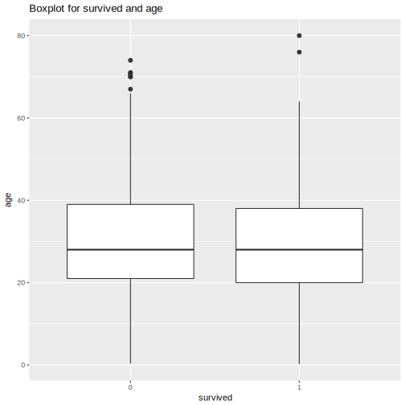
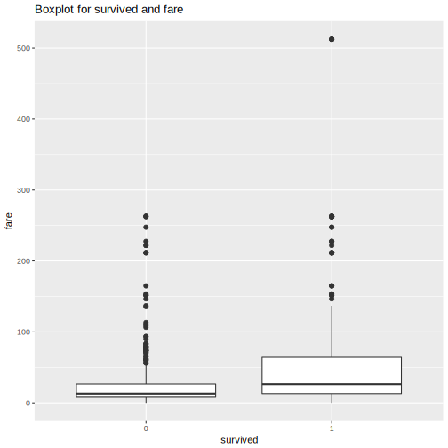

##Origin data


```r
titanic=read.csv("https://raw.github.ubc.ca/ubc-mds-2017/datasets/master/data/titanic.csv?token=AAADqC0ANzUKk2ZCPXF4Sb13ucDojAHxks5aNpHbwA%3D%3D", header=TRUE)
head(titanic)
```

```
##   pclass survived                                            name    sex
## 1      1        1                   Allen, Miss. Elisabeth Walton female
## 2      1        1                  Allison, Master. Hudson Trevor   male
## 3      1        0                    Allison, Miss. Helen Loraine female
## 4      1        0            Allison, Mr. Hudson Joshua Creighton   male
## 5      1        0 Allison, Mrs. Hudson J C (Bessie Waldo Daniels) female
## 6      1        1                             Anderson, Mr. Harry   male
##       age sibsp parch ticket     fare   cabin embarked boat body
## 1 29.0000     0     0  24160 211.3375      B5        S    2   NA
## 2  0.9167     1     2 113781 151.5500 C22 C26        S   11   NA
## 3  2.0000     1     2 113781 151.5500 C22 C26        S        NA
## 4 30.0000     1     2 113781 151.5500 C22 C26        S       135
## 5 25.0000     1     2 113781 151.5500 C22 C26        S        NA
## 6 48.0000     0     0  19952  26.5500     E12        S    3   NA
##                         home.dest
## 1                    St Louis, MO
## 2 Montreal, PQ / Chesterville, ON
## 3 Montreal, PQ / Chesterville, ON
## 4 Montreal, PQ / Chesterville, ON
## 5 Montreal, PQ / Chesterville, ON
## 6                    New York, NY
```

```r
str(titanic)
```

```
## 'data.frame':	1309 obs. of  14 variables:
##  $ pclass   : int  1 1 1 1 1 1 1 1 1 1 ...
##  $ survived : int  1 1 0 0 0 1 1 0 1 0 ...
##  $ name     : Factor w/ 1307 levels "Abbing, Mr. Anthony",..: 22 24 25 26 27 31 46 47 51 55 ...
##  $ sex      : Factor w/ 2 levels "female","male": 1 2 1 2 1 2 1 2 1 2 ...
##  $ age      : num  29 0.917 2 30 25 ...
##  $ sibsp    : int  0 1 1 1 1 0 1 0 2 0 ...
##  $ parch    : int  0 2 2 2 2 0 0 0 0 0 ...
##  $ ticket   : Factor w/ 929 levels "110152","110413",..: 188 50 50 50 50 125 93 16 77 826 ...
##  $ fare     : num  211 152 152 152 152 ...
##  $ cabin    : Factor w/ 187 levels "","A10","A11",..: 45 81 81 81 81 151 147 17 63 1 ...
##  $ embarked : Factor w/ 4 levels "","C","Q","S": 4 4 4 4 4 4 4 4 4 2 ...
##  $ boat     : Factor w/ 28 levels "","1","10","11",..: 13 4 1 1 1 14 3 1 28 1 ...
##  $ body     : int  NA NA NA 135 NA NA NA NA NA 22 ...
##  $ home.dest: Factor w/ 370 levels "","?Havana, Cuba",..: 310 232 232 232 232 238 163 25 23 230 ...
```

##Clean data

```r
titanic_clean=read.csv("results/clean_titanic.csv", header=TRUE)
head(titanic_clean)
```

```
##   X pclass survived                                            name    sex
## 1 1      1        1                   Allen, Miss. Elisabeth Walton female
## 2 2      1        1                  Allison, Master. Hudson Trevor   male
## 3 3      1        0                    Allison, Miss. Helen Loraine female
## 4 4      1        0            Allison, Mr. Hudson Joshua Creighton   male
## 5 5      1        0 Allison, Mrs. Hudson J C (Bessie Waldo Daniels) female
## 6 6      1        1                             Anderson, Mr. Harry   male
##       age sibsp parch ticket     fare   cabin embarked boat body
## 1 29.0000     0     0  24160 211.3375      B5        S    2   NA
## 2  0.9167     1     2 113781 151.5500 C22 C26        S   11   NA
## 3  2.0000     1     2 113781 151.5500 C22 C26        S        NA
## 4 30.0000     1     2 113781 151.5500 C22 C26        S       135
## 5 25.0000     1     2 113781 151.5500 C22 C26        S        NA
## 6 48.0000     0     0  19952  26.5500     E12        S    3   NA
##                         home.dest
## 1                    St Louis, MO
## 2 Montreal, PQ / Chesterville, ON
## 3 Montreal, PQ / Chesterville, ON
## 4 Montreal, PQ / Chesterville, ON
## 5 Montreal, PQ / Chesterville, ON
## 6                    New York, NY
```

```r
str(titanic_clean)
```

```
## 'data.frame':	1045 obs. of  15 variables:
##  $ X        : int  1 2 3 4 5 6 7 8 9 10 ...
##  $ pclass   : int  1 1 1 1 1 1 1 1 1 1 ...
##  $ survived : int  1 1 0 0 0 1 1 0 1 0 ...
##  $ name     : Factor w/ 1043 levels "Abbing, Mr. Anthony",..: 22 24 25 26 27 31 46 47 51 55 ...
##  $ sex      : Factor w/ 2 levels "female","male": 1 2 1 2 1 2 1 2 1 2 ...
##  $ age      : num  29 0.917 2 30 25 ...
##  $ sibsp    : int  0 1 1 1 1 0 1 0 2 0 ...
##  $ parch    : int  0 2 2 2 2 0 0 0 0 0 ...
##  $ ticket   : Factor w/ 731 levels "110152","110413",..: 160 40 40 40 40 105 79 14 66 645 ...
##  $ fare     : num  211 152 152 152 152 ...
##  $ cabin    : Factor w/ 175 levels "","A10","A11",..: 41 76 76 76 76 142 138 14 59 1 ...
##  $ embarked : Factor w/ 4 levels "","C","Q","S": 4 4 4 4 4 4 4 4 4 2 ...
##  $ boat     : Factor w/ 27 levels "","1","10","11",..: 12 4 1 1 1 13 3 1 27 1 ...
##  $ body     : int  NA NA NA 135 NA NA NA NA NA 22 ...
##  $ home.dest: Factor w/ 349 levels "","?Havana, Cuba",..: 293 218 218 218 218 224 155 24 23 216 ...
```

##Linear model between age and survived

```r
test1=read.csv("results/age_survived.csv", header=TRUE)
test1
```

```
##   X        term     estimate   std.error statistic      p.value
## 1 1 (Intercept)  0.463666418 0.035017539 13.240977 4.181024e-37
## 2 2         age -0.001844241 0.001056788 -1.745138 8.125528e-02
```

##plot


>My first hypotheses is that old man had lower survive rate than child, because the old man's physical fitness is not as good as young man. 
We can see as above, the two groups age are no significant different and the p-value is more than 0.1. So there are no significant linear relation between age and survived.

##Linear model between fare and survived

```r
test2=read.csv("results/fare_survived.csv", header=TRUE)
test2
```

```
##   X        term    estimate    std.error statistic      p.value
## 1 1 (Intercept) 0.327948954 0.0176507399 18.579898 8.671617e-67
## 2 2        fare 0.002198749 0.0002646252  8.308919 2.978490e-16
```

##plot


>My second hypotheses is that people who pay high fare has higher survive rate than others.
We can see as above, the two groups fare are significant different and the p-value is less than 0.01. So there are significant linear relation between age and survived. My second hypotheses is right.


