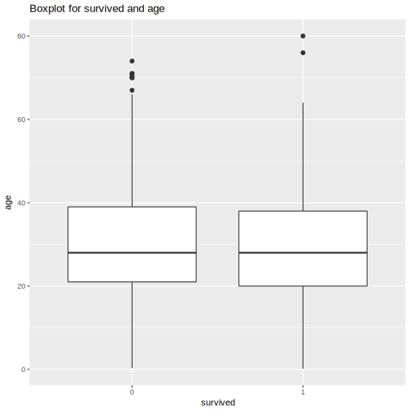
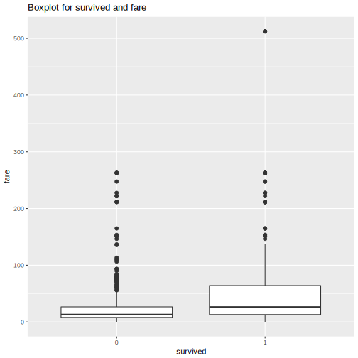

```{r setup, include=FALSE}
knitr::opts_chunk$set(echo = TRUE)
```

##Origin data

```{r}
titanic=read.csv("https://raw.github.ubc.ca/ubc-mds-2017/datasets/master/data/titanic.csv?token=AAADqC0ANzUKk2ZCPXF4Sb13ucDojAHxks5aNpHbwA%3D%3D", header=TRUE)
head(titanic)
str(titanic)
```

##Clean data
```{r}
titanic_clean=read.csv("../data/titanic_clean.csv", header=TRUE)
head(titanic_clean)
str(titanic_clean)
```

##Linear model between age and survived
```{r}
test1=read.csv("../results/test1.csv", header=TRUE)
test1
```

##plot


>My first hypotheses is that old man had lower survive rate than child, because the old man's physical fitness is not as good as young man. 
We can see as above, the two groups age are no significant different and the p-value is more than 0.1. So there are no significant linear relation between age and survived.

##Linear model between fare and survived
```{r}
test2=read.csv("../results/test2.csv", header=TRUE)
test2
```

##plot


>My second hypotheses is that people who pay high fare has higher survive rate than others.
We can see as above, the two groups fare are significant different and the p-value is less than 0.01. So there are significant linear relation between age and survived. My second hypotheses is right.


